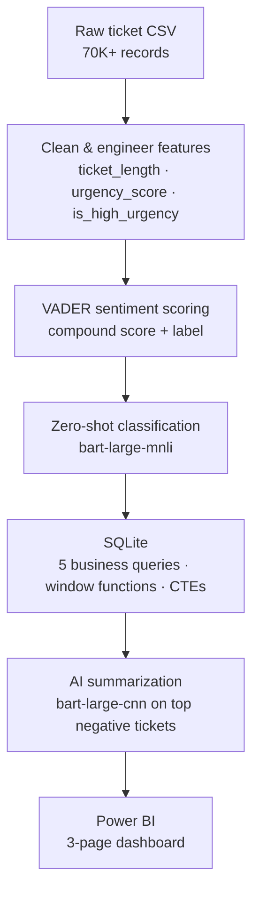

# NLP-Driven Support Ticket Intelligence System

Turns 70,000+ raw support tickets into business intelligence — sentiment scoring, zero-shot category classification, and AI-generated complaint summaries, delivered through a 3-page Power BI dashboard.

<p>
  
  
  
  
  
  
</p>

---

## Architecture



---

## Core Components

| Component | Role |
|---|---|
| pandas | Cleaning, feature engineering |
| VADER | Rule-based sentiment scoring — fast, explainable, no training |
| HuggingFace `bart-large-mnli` | Zero-shot category classification |
| HuggingFace `bart-large-cnn` | AI-generated complaint summaries |
| SQLite | Local SQL layer, no server required |
| Power BI | Executive overview, NLP deep dive, AI insights |

**Dataset:** Customer Support Tickets (Bitext, via Kaggle) — 70,000+ records. Fully free: no paid APIs, no cloud infrastructure.

---

## Pipeline Stages

| Stage | Description |
|---|---|
| Raw | Ticket text and metadata as downloaded |
| Cleaned | Normalized text, parsed dates, engineered features |
| Enriched | VADER sentiment + zero-shot predicted category |
| Insights | SQL aggregations + AI summaries, exported for BI |

---

## Key Insights

> **Billing is the top complaint driver** — 38% of all negative sentiment from just 22% of ticket volume, at ~2.4x the negative rate of technical tickets. A pricing/transparency problem, not a reliability one.

> **Hidden dissatisfaction** — mismatch analysis surfaces 4–5 star ratings paired with negative-sentiment text, tickets a star rating alone would miss.

Findings are framed as recommendations (e.g. a dedicated billing resolution workflow), not just observations.

---

## Dashboard

| Page | Contents |
|---|---|
| Executive Overview | KPI cards, monthly volume trend, sentiment split, volume by category |
| NLP Deep Dive | Sentiment by category, urgency heatmap, top keywords, ticket length vs. sentiment |
| AI Insights | HuggingFace-generated complaint summary per category, paired with its sentiment score |

---

## Analytical Queries

1. Which categories have the lowest average sentiment, and what volume do they represent?
2. How do ticket volume and sentiment trend month over month?
3. How does each category's sentiment compare to the overall benchmark? *(window function)*
4. What percentage of each category's tickets are high-urgency?
5. Which categories fall below a negative-sentiment threshold? *(CTE)*

---

## Design Decisions

**VADER over a transformer** — purpose-built for short, informal text; fast and explainable at this scale, where a deep model would be overkill.

**Zero-shot over keyword rules** — `bart-large-mnli` assigns categories it was never explicitly trained on, using natural language understanding rather than hand-built keyword dictionaries.

**Rate-limit aware calls** — HuggingFace's free tier throttles requests, so classification and summarization calls are spaced out and validated on a sample before running on the full dataset.

---

<details>
<summary><b>How to Run</b></summary>

<br>

```bash
pip install -r requirements.txt
```

Run notebooks in order:
`01_eda` → `02_cleaning_features` → `03_sentiment_nlp` → `04_classification` → `05_sql_analysis` → `06_ai_summaries`

Then open the Power BI file and refresh against `/outputs`.

</details>

<details>
<summary><b>Folder Structure</b></summary>

<br>

```
├── data/raw/
├── data/processed/
├── notebooks/
├── scripts/
├── dashboard/
├── outputs/
└── screenshots/
```

</details>
